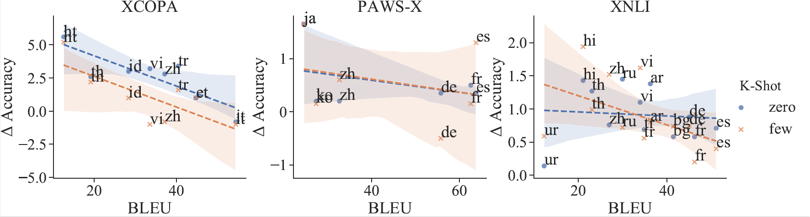

# Modelling Latent Translations for Cross-Lingual Transfer

[**Documentation**](#prerequisites) | [**Cite**](#cite) | [**Paper**](https://ducdauge.github.io/files/)

While often achieving SOTA results, “translation test” suffers from some limitations: 1) errors accumulate along the pipeline and cannot be corrected; 2) only the maximum-likelihood translation is generated, which is not necessarily the most relevant to the downstream task. 

Instead, we integrate both translator and classifier into a single model, by treating the intermediate translations as a latent random variable. By initialising both components with pre-trained models, our method is suitable for few-shot learning. 

By performing inference under this model, 1) we fine-tune the translator end-to-end or via Minimum Risk Training according to the downstream task loss; 2) we draw multiple translation samples to perform ensemble prediction in the downstream task. 

For instance, the following example from Turkish XCOPA reveals how the maximum-likelihood translation leads to a wrong prediction. On the other hand, majority voting from multiple translation samples recover the correct prediction.

| NLL | Premise | Hypothesis 1 | Hypothesis 2 | Prediction |
| --- | --- | --- | --- | --- |
| | *Adam partide çok içti.* | *Ertesi gün başı ağrıdı.* | *Ertesi gün burnu aktı.* | |
| -1.49 | He drank too much at the party. | She had a headache the next day. | The next day, he had a runny nose. | 1 |
| -2.07 | The guy drank too much at the party. | He had a headache the next day. | The next day, his nose leaked. | 0 |
| -2.26 | The guy drank a lot at the party. | He got a headache the next day. | The next day, his nose ran. | 0 |

## Prerequisites

- Python 3.7
- ```pip install -r requirements.txt```

## Data
The datasets for the experiments reported in the paper can be obtained with this command:

```bash
cd scripts
bash download_data.sh
```

The traslations into English of their test sets via Google MT can be found at the following links:

| Dataset | Task | Google Translate |
| --- | --- | --- |
|XNLI|Natural Language Inference|[link](https://console.cloud.google.com/storage/browser/xtreme_translations/XNLI)|
|XCOPA|Commonsense Reasoning|[link](https://github.com/cambridgeltl/xcopa/tree/master/data-gmt)|
|PAWS-X|Paraphrase Identification|[link](https://console.cloud.google.com/storage/browser/xtreme_translations/PAWSX)|

## Experiments
For cross-lingual transfer based on neural machine translation:
```python
python train.py --task_name <xcopa|pawsx|xnli> --mode <trans-soft|trans-hard> --nmt_model_name <marian|google|mbart50> --do_train --do_eval --do_refine --num_samples 12 --per_gpu_train_batch_size 1 --gradient_accumulation_steps 24 --learning_rate 8e-6 --per_gpu_eval_batch_size 2
```

Note that the number of translation samples is specified by `--num_samples`. By setting `--mode trans-soft` the translator parameters are fine-tuned with Minimum Risk Training, whereas `--mode trans-hard` keeps them frozen.

For cross-lingual transfer based on multilingual encoders:
```python
python train.py --task_name <xcopa|pawsx|xnli> --mode multi --cls_model_name <xlmr|mbart50> --do_train --do_eval --do_refine --per_gpu_train_batch_size 4 --gradient_accumulation_steps 6 --learning_rate 8e-6 --max_seq_length 384 --num_train_epochs 2 --save_steps 1000
```

## Visualisations
Our method yields larger gains for languages whose BLEU scores are lower. This plot shows the correlation between NMT BLEU score and gains compared to vanilla translate test.


